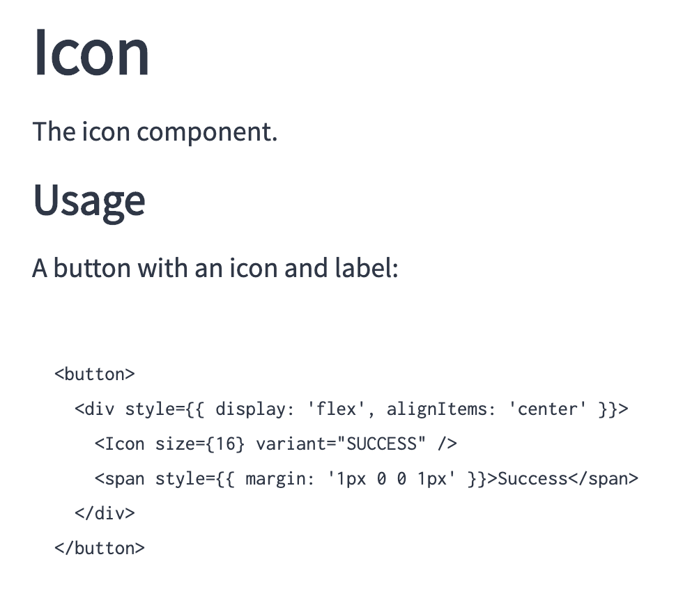
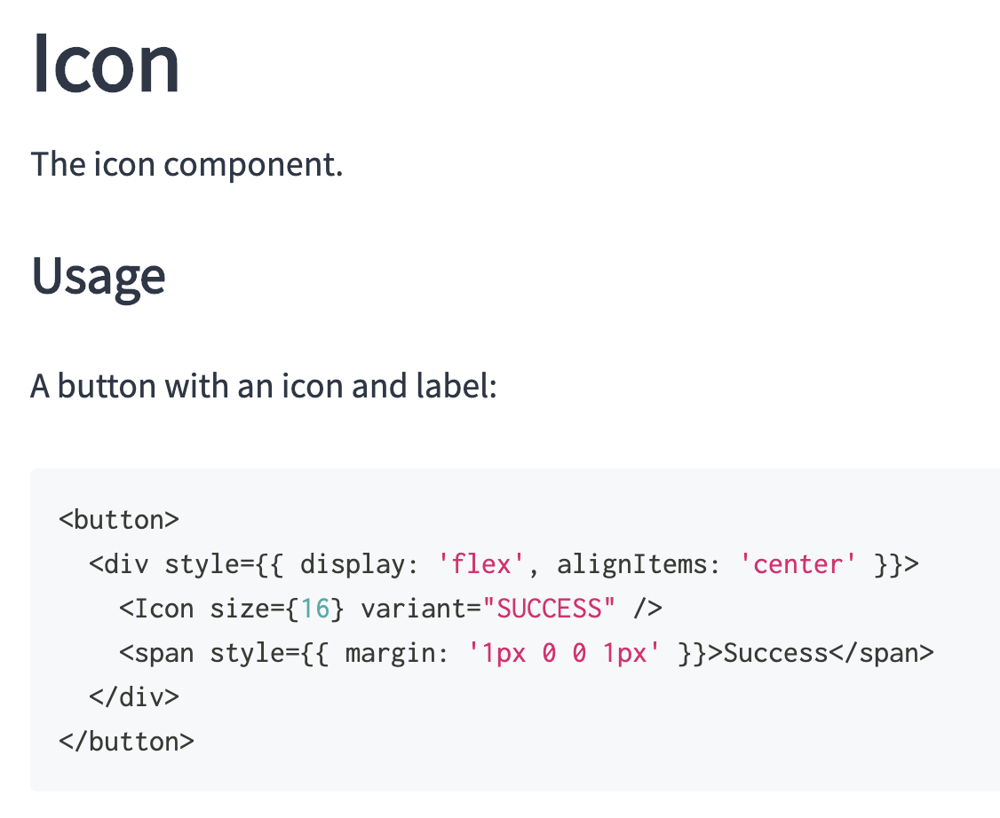
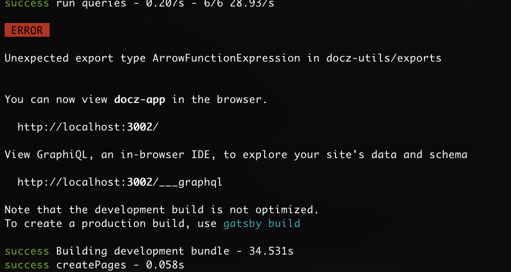

# docz-issue-1443

Reproduction of https://github.com/doczjs/docz/issues/1443

## Instructions

First, install:

- Node 12.16.1
- npm 6.13.7
- yarn 1.22.4

The code is configured to use Docz 2.3.0 __to show the bug__.

```bash
$ yarn
$ yarn docs:dev
```

Open browser to http://localhost:3002/atoms/icon and look at the non-formatted code fence (not expected):



Update the [docs/package.json](./docs/package.json) to:

- docz: "2.2.0"
- gatsby-theme-docz: "2.2.0"

Now update deps and run Docz again:

```bash
$ yarn
$ yarn docs:dev
```

Open browser to http://localhost:3002/atoms/icon and look at the formatted code fence (expected):



## Other

Incidentally, what are these errors about? They occur in both 2.2.0 and 2.3.0.


